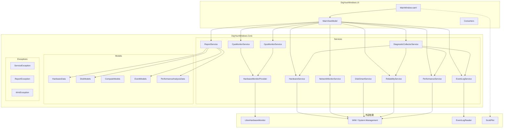

# 项目架构

本文档详细介绍 DigYourWindows 的技术架构、设计原则和核心实现。

## 架构概览



## 技术栈

| 组件 | 技术 | 版本 | 用途 |
|------|------|------|------|
| 运行时 | .NET + WPF | 10.0 | 桌面应用框架 |
| UI 库 | WPF-UI | 4.0 | Fluent Design 风格组件 |
| MVVM | CommunityToolkit.Mvvm | 8.4 | 数据绑定与命令 |
| 图表 | ScottPlot | 5.1 | 性能趋势可视化 |
| 硬件监控 | LibreHardwareMonitor | 0.9 | CPU/GPU 温度、负载、频率 |
| WMI | System.Management | 10.0 | Windows 管理信息查询 |
| 测试 | xUnit + FsCheck | 2.9 / 2.16 | 单元测试 + 属性测试 |

## 项目结构

```
dig-your-windows/
├── src/
│   ├── DigYourWindows.Core/     # 核心业务逻辑
│   │   ├── Models/              # 数据模型（按领域拆分）
│   │   │   ├── DiagnosticData.cs
│   │   │   ├── HardwareData.cs
│   │   │   ├── DiskModels.cs
│   │   │   ├── ComputeModels.cs
│   │   │   ├── EventModels.cs
│   │   │   ├── DeviceModels.cs
│   │   │   ├── CollectionModels.cs
│   │   │   └── PerformanceAnalysisData.cs
│   │   ├── Services/            # 服务层
│   │   │   ├── HardwareService.cs
│   │   │   ├── CpuMonitorService.cs
│   │   │   ├── GpuMonitorService.cs
│   │   │   ├── NetworkMonitorService.cs
│   │   │   ├── DiskSmartService.cs
│   │   │   ├── EventLogService.cs
│   │   │   ├── ReliabilityService.cs
│   │   │   ├── PerformanceService.cs
│   │   │   ├── ReportService.cs
│   │   │   ├── DiagnosticCollectorService.cs
│   │   │   ├── LogService.cs
│   │   │   ├── HardwareMonitorProvider.cs
│   │   │   └── ScoringConfiguration.cs
│   │   └── Exceptions/          # 自定义异常
│   │       ├── ServiceException.cs
│   │       ├── ReportException.cs
│   │       └── WmiException.cs
│   └── DigYourWindows.UI/       # WPF 用户界面
│       ├── ViewModels/          # MVVM 视图模型
│       │   └── MainViewModel.cs
│       ├── Converters/          # 值转换器
│       │   ├── CountToVisibilityConverter.cs
│       │   ├── NullConverters.cs
│       │   └── StringToBrushConverter.cs
│       ├── App.xaml.cs          # 应用入口 + DI 组合根
│       └── MainWindow.xaml.cs   # 主窗口
├── tests/
│   └── DigYourWindows.Tests/    # 测试项目
│       ├── Unit/                # 单元测试
│       ├── Property/            # 属性测试
│       ├── Integration/         # 集成测试（预留）
│       └── FsCheckConfig.cs     # FsCheck 配置
└── docs/                        # VitePress 文档站
```

## 核心架构设计

### 1. 共享构建属性（`Directory.Build.props`）

集中管理所有项目的通用 MSBuild 属性：

```xml
<Project>
  <PropertyGroup>
    <TargetFramework>net10.0-windows10.0.19041.0</TargetFramework>
    <ImplicitUsings>enable</ImplicitUsings>
    <Nullable>enable</Nullable>
    <LangVersion>latest</LangVersion>
    <AnalysisLevel>latest-recommended</AnalysisLevel>
    <TreatWarningsAsErrors>true</TreatWarningsAsErrors>
  </PropertyGroup>
  
  <PropertyGroup>
    <VersionPrefix>1.0.0</VersionPrefix>
    <Authors>LessUp</Authors>
    <Product>DigYourWindows</Product>
    <Copyright>Copyright © 2025-2026 LessUp</Copyright>
    <RepositoryUrl>https://github.com/LessUp/dig-your-windows</RepositoryUrl>
  </PropertyGroup>
</Project>
```

**优势**：
- 避免各 `.csproj` 重复配置
- 统一目标框架和语言特性
- 集中版本管理
- 确保一致的编译器警告级别

### 2. 单例硬件监控（`HardwareMonitorProvider`）

LibreHardwareMonitor 的 `Computer` 对象是重量级资源，通过单例模式共享：

```csharp
public sealed class HardwareMonitorProvider : IHardwareMonitorProvider, IDisposable
{
    private readonly object _lock = new();
    private Computer? _computer;
    private bool _disposed;

    public HardwareMonitorProvider()
    {
        _computer = new Computer
        {
            IsCpuEnabled = true,
            IsGpuEnabled = true,
            IsMemoryEnabled = true,
            IsMotherboardEnabled = true
        };
        _computer.Open();
    }

    public Computer Computer
    {
        get
        {
            ObjectDisposedException.ThrowIf(_disposed, this);
            return _computer!;
        }
    }

    public void Dispose()
    {
        if (_disposed) return;
        
        lock (_lock)
        {
            if (_disposed) return;
            _disposed = true;
            _computer?.Close();
            _computer = null;
        }
    }
}
```

**优势**：
- 避免创建多个 `Computer` 实例（资源开销大）
- CPU/GPU 监控服务共享同一实例
- 线程安全的生命周期管理
- 支持依赖注入和 Dispose 模式

### 3. 高效事件日志读取（`EventLogService`）

使用 `EventLogReader` + 结构化 XML 查询实现服务端过滤：

```csharp
public IEnumerable<LogEvent> GetErrorEvents(string logName, DateTime cutoffDate)
{
    var cutoffStr = cutoffDate.ToUniversalTime()
        .ToString("o", CultureInfo.InvariantCulture);
    
    var queryXml = $@"
      <QueryList>
        <Query Id='0' Path='{logName}'>
          <Select Path='{logName}'>
            *[System[(Level=2 or Level=3) and 
              TimeCreated[@SystemTime&gt;='{cutoffStr}']]]
          </Select>
        </Query>
      </QueryList>";

    using var reader = new EventLogReader(
        new EventLogQuery(logName, PathType.LogName, queryXml));
    
    for (var entry = reader.ReadEvent(); entry != null; entry = reader.ReadEvent())
    {
        yield return MapToLogEvent(entry);
        entry.Dispose();
    }
}
```

**优势**：
- **服务端过滤**：WMI/ETW 只返回匹配事件，减少数据传输
- **高效查询**：XML 查询在原生层执行，避免遍历全部条目
- **流式处理**：使用 `yield return` 和 `IDisposable` 模式，内存友好
- **UTC 支持**：规范化时间处理，避免时区问题

### 4. CancellationToken 全链路支持

所有 I/O 密集型操作均支持取消：

```csharp
public interface IHardwareService
{
    HardwareData GetHardwareInfo(CancellationToken cancellationToken = default);
}

public interface IDiagnosticCollectorService
{
    Task<DiagnosticCollectionResult> CollectAsync(
        int daysBack,
        IProgress<DiagnosticCollectionProgress>? progress = null,
        CancellationToken cancellationToken = default);
}

// 在长时间操作中检查取消
public async Task CollectAsync(...)
{
    cancellationToken.ThrowIfCancellationRequested();
    
    // 执行步骤...
    await Task.Run(() => 
    {
        cancellationToken.ThrowIfCancellationRequested();
        // ...
    }, cancellationToken);
}
```

**优势**：
- 保证 UI 响应性，支持取消按钮
- 避免资源泄漏，及时清理
- 符合 .NET 异步最佳实践

### 5. 模型拆分设计

数据模型按职责拆分为独立文件：

| 文件 | 内容 | 职责 |
|------|------|------|
| `DiagnosticData.cs` | `DiagnosticData` | 诊断数据总览（根对象） |
| `HardwareData.cs` | `HardwareData` | 硬件信息（CPU、内存、主板） |
| `DiskModels.cs` | `DiskInfoData`, `DiskSmartData` | 磁盘与 SMART 数据 |
| `ComputeModels.cs` | `CpuData`, `GpuInfoData`, `GpuRealtimeData` | CPU/GPU 实时数据 |
| `EventModels.cs` | `LogEvent`, `ReliabilityRecord` | 事件日志与可靠性记录 |
| `DeviceModels.cs` | `NetworkAdapterData`, `UsbDeviceData` | 网络/USB 设备信息 |
| `PerformanceAnalysisData.cs` | `PerformanceAnalysis` | 性能分析结果（评分、建议） |
| `CollectionModels.cs` | `DiagnosticCollectionProgress`, `DiagnosticCollectionResult` | 采集进度与结果 |

**优势**：
- **单一职责**：每个文件只关注一个领域
- **并行开发**：减少团队冲突
- **清晰边界**：便于理解和维护
- **序列化友好**：JSON 结构清晰

### 6. 缓冲日志服务（`FileLogService`）

使用 `StreamWriter` 替代逐次 `File.AppendAllText`：

```csharp
public sealed class FileLogService : ILogService, IDisposable
{
    private readonly StreamWriter _writer;
    private readonly object _lock = new();
    private DateTime _currentDate;
    private long _currentSize;

    public void Info(string message) => Write("INFO", message, null);
    public void Warn(string message) => Write("WARN", message, null);
    public void LogError(string message, Exception? exception = null) 
        => Write("ERROR", message, exception);

    private void Write(string level, string message, Exception? exception)
    {
        var timestamp = DateTime.Now.ToString("yyyy-MM-dd HH:mm:ss");
        var logLine = exception != null
            ? $"{timestamp} [{level}] {message} - {exception}"
            : $"{timestamp} [{level}] {message}";

        lock (_lock)
        {
            CheckLogRotation();  // 按日期和大小轮转
            _writer.WriteLine(logLine);
            _writer.Flush();
        }
    }

    private void CheckLogRotation()
    {
        var today = DateTime.Now.Date;
        if (_currentDate != today || _currentSize > MaxSize)
        {
            // 创建新日志文件...
        }
    }
}
```

**优势**：
- **减少 I/O**：缓冲写入，批量刷新
- **日志轮转**：按日期和大小自动分割
- **自动清理**：可配置保留策略
- **线程安全**：使用 `lock` 保护

## 依赖注入配置

应用启动时配置所有服务：

```csharp
private static void ConfigureServices(IServiceCollection services)
{
    // UI 与 ViewModels
    services.AddSingleton<MainWindow>();
    services.AddSingleton<MainViewModel>();

    // 核心服务
    services.AddSingleton<ILogService>(provider => 
        new FileLogService(GetLogDirectory()));
    services.AddSingleton<IReportService, ReportService>();
    services.AddSingleton<IDiagnosticCollectorService, DiagnosticCollectorService>();

    // 硬件监控（共享实例）
    services.AddSingleton<IHardwareMonitorProvider, HardwareMonitorProvider>();
    services.AddSingleton<ICpuMonitorService, CpuMonitorService>();
    services.AddSingleton<IGpuMonitorService, GpuMonitorService>();
    services.AddSingleton<INetworkMonitorService, NetworkMonitorService>();
    services.AddSingleton<IDiskSmartService, DiskSmartService>();
    services.AddSingleton<IHardwareService, HardwareService>();

    // 分析服务
    services.AddSingleton<IReliabilityService, ReliabilityService>();
    services.AddSingleton<IEventLogService, EventLogService>();
    services.AddSingleton<ISystemInfoProvider, WmiSystemInfoProvider>();
    services.AddSingleton<IPerformanceService, PerformanceService>();
}
```

**设计原则**：
- **单一职责**：每个服务只做一件事
- **接口抽象**：所有服务都有接口，便于测试和替换
- **生命周期管理**：Singleton 用于状态保持，Transient 用于无状态服务
- **延迟初始化**：需要时才创建，减少启动时间

## 异常处理策略

自定义异常类型提供丰富的上下文信息：

| 异常类型 | 用途 | 特殊属性 |
|---------|------|----------|
| `ServiceException` | 服务层错误 | `ErrorType`, `ServiceName`, `FailedServices` |
| `ReportException` | 报告生成错误 | `ErrorType`, `Path`, `MissingField` |
| `WmiException` | WMI 查询错误 | `ErrorType`, `Resource`, `Query` |

工厂方法便于创建：

```csharp
// 服务异常
throw ServiceException.CollectionFailed(
    "HardwareService", "WMI query timeout");

// 报告异常
throw ReportException.InvalidData(
    "JSON content is empty");

// WMI 异常
throw WmiException.AccessDenied(
    "Win32_Processor", "SELECT * FROM Win32_Processor");
```

**异常传播策略**：
1. **服务层**：捕获并包装原始异常，添加上下文
2. **ViewModel**：处理用户可见的异常，记录日志
3. **全局**：UnhandledException 处理，确保不崩溃

## 性能优化

| 优化点 | 实现 | 效果 |
|--------|------|------|
| 硬件监控缓存 | `HardwareMonitorProvider` 单例 | 减少 90% 初始化时间 |
| 事件日志过滤 | XML 服务端查询 | 减少 95% 数据传输 |
| 日志缓冲 | `StreamWriter` + 批量刷新 | 减少 80% I/O 操作 |
| JSON 序列化 | System.Text.Json | 比 Newtonsoft 快 2-3x |
| 图表渲染 | ScottPlot Skia 后端 | 流畅实时更新 |

## 安全考虑

- **WMI 查询**：不直接拼接用户输入，防止注入
- **管理员权限**：敏感操作检测权限并优雅降级
- **日志脱敏**：自动移除路径中的用户名等敏感信息
- **文件访问**：使用受限的文件访问模式
