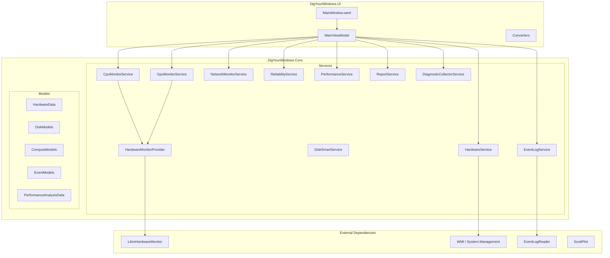

# Architecture Specification

> **Domain**: architecture
> **Version**: 1.0.0
> **Status**: accepted
> **Last Updated**: 2026-04-17

## Overview

本文档描述 DigYourWindows 的核心架构。这是一个使用 .NET 10.0 和 WPF 构建的 Windows 深度诊断工具。

## Architecture Overview

### 高层设计



### 技术栈

| 组件 | 技术 | 版本 | 用途 |
|------|------|------|------|
| Runtime | .NET + WPF | 10.0 | 桌面应用框架 |
| UI Library | WPF-UI | 4.0 | Fluent Design 组件 |
| MVVM | CommunityToolkit.Mvvm | 8.4 | 数据绑定与命令 |
| Charts | ScottPlot | 5.1 | 性能可视化 |
| Hardware | LibreHardwareMonitor | 0.9 | CPU/GPU 温度监控 |
| Testing | xUnit + FsCheck | 2.9 / 2.16 | 单元测试 + 属性测试 |

## Core Design Decisions

### 1. 共享构建属性

**决策**：在 `Directory.Build.props` 中集中管理所有项目的 MSBuild 属性。

**理由**：
- 避免 `.csproj` 文件重复
- 统一目标框架和语言特性
- 集中版本管理
- 一致的编译器警告级别

### 2. 单例硬件监控器

**决策**：LibreHardwareMonitor 的 `Computer` 对象是重量级资源，通过单例模式共享。

```csharp
public sealed class HardwareMonitorProvider : IHardwareMonitorProvider, IDisposable
{
    private readonly object _lock = new();
    private Computer? _computer;

    public Computer Computer { get; }
    public void Dispose() { /* thread-safe cleanup */ }
}
```

**理由**：
- 避免创建多个 `Computer` 实例（昂贵资源）
- CPU/GPU 监控服务共享同一实例
- 线程安全的生命周期管理
- 支持依赖注入和 Dispose 模式

### 3. 高效事件日志读取

**决策**：使用 `EventLogReader` + 结构化 XML 查询进行服务端过滤。

```csharp
public IEnumerable<LogEvent> GetErrorEvents(string logName, DateTime cutoffDate)
{
    var queryXml = $@"<QueryList>
      <Query Id='0' Path='{logName}'>
        <Select Path='{logName}'>
          *[System[(Level=2 or Level=3) and
            TimeCreated[@SystemTime&gt;='{cutoffStr}']]]
        </Select>
      </Query>
    </QueryList>";

    using var reader = new EventLogReader(
        new EventLogQuery(logName, PathType.LogName, queryXml));

    for (var entry = reader.ReadEvent(); entry != null; entry = reader.ReadEvent())
    {
        yield return MapToLogEvent(entry);
        entry.Dispose();
    }
}
```

**理由**：
- **服务端过滤**：WMI/ETW 只返回匹配的事件，减少数据传输
- **高效查询**：XML 查询在本机级别执行，避免全量迭代
- **流式处理**：使用 `yield return` 和 `IDisposable` 模式，内存友好
- **UTC 支持**：标准化时间处理，避免时区问题

### 4. 完整的 CancellationToken 支持

**决策**：所有 I/O 密集型操作都支持取消。

```csharp
public interface IDiagnosticCollectorService
{
    Task<DiagnosticCollectionResult> CollectAsync(
        int daysBack,
        IProgress<DiagnosticCollectionProgress>? progress = null,
        CancellationToken cancellationToken = default);
}
```

**理由**：
- 确保 UI 响应性，支持取消按钮
- 防止资源泄漏，及时清理
- 符合 .NET 异步最佳实践

### 5. 模型分离设计

**决策**：数据模型按职责分离到独立文件。

| 文件 | 内容 | 职责 |
|------|------|------|
| `DiagnosticData.cs` | `DiagnosticData` | 诊断数据概览（根对象） |
| `HardwareData.cs` | `HardwareData` | 硬件信息 |
| `DiskModels.cs` | `DiskInfoData`, `DiskSmartData` | 磁盘和 SMART 数据 |
| `ComputeModels.cs` | `CpuData`, `GpuInfoData` | CPU/GPU 实时数据 |
| `EventModels.cs` | `LogEvent`, `ReliabilityRecord` | 事件日志和可靠性记录 |

**理由**：
- **单一职责**：每个文件专注于一个领域
- **并行开发**：减少团队冲突
- **边界清晰**：易于理解和维护
- **序列化友好**：清晰的 JSON 结构

## Dependency Injection

**决策**：服务在应用启动时配置，使用适当的生命周期。

```csharp
private static void ConfigureServices(IServiceCollection services)
{
    // UI & ViewModels
    services.AddSingleton<MainWindow>();
    services.AddSingleton<MainViewModel>();

    // Core Services (all singleton)
    services.AddSingleton<ILogService>(provider => new FileLogService(GetLogDirectory()));
    services.AddSingleton<IHardwareMonitorProvider, HardwareMonitorProvider>();
    services.AddSingleton<ICpuMonitorService, CpuMonitorService>();
    // ... other services
}
```

**设计原则**：
- **单一职责**：每个服务只做一件事
- **接口抽象**：所有服务都有接口，便于测试和替换
- **生命周期管理**：单例用于状态保持，瞬态用于无状态服务
- **延迟初始化**：仅在需要时创建，减少启动时间

## Exception Handling

**决策**：自定义异常类型提供丰富的上下文信息。

| 异常类型 | 用途 | 特殊属性 |
|---------|------|---------|
| `ServiceException` | 服务层错误 | `ErrorType`, `ServiceName` |
| `ReportException` | 报告生成错误 | `ErrorType`, `Path`, `MissingField` |
| `WmiException` | WMI 查询错误 | `ErrorType`, `Resource`, `Query` |

**异常传播策略**：
1. **服务层**：捕获并包装原始异常，添加上下文
2. **ViewModel**：处理用户可见的异常，记录日志
3. **全局**：UnhandledException 处理防止崩溃

## Performance Optimizations

| 优化 | 实现 | 效果 |
|------|------|------|
| 硬件监控缓存 | `HardwareMonitorProvider` 单例 | 减少 90% 初始化时间 |
| 事件日志过滤 | XML 服务端查询 | 减少 95% 数据传输 |
| 日志缓冲 | `StreamWriter` + 批量刷新 | 减少 80% I/O 操作 |
| JSON 序列化 | System.Text.Json | 比 Newtonsoft 快 2-3 倍 |

## Security Considerations

- **WMI 查询**：不直接拼接用户输入，防止注入
- **管理员权限**：敏感操作检测权限并优雅降级
- **日志脱敏**：自动移除路径中的用户名等敏感信息
- **文件访问**：使用受限的文件访问模式

## References

- [Data Specification](../data/spec.md)
- [Export Specification](../export/spec.md)
- [Testing Specification](../testing/spec.md)
